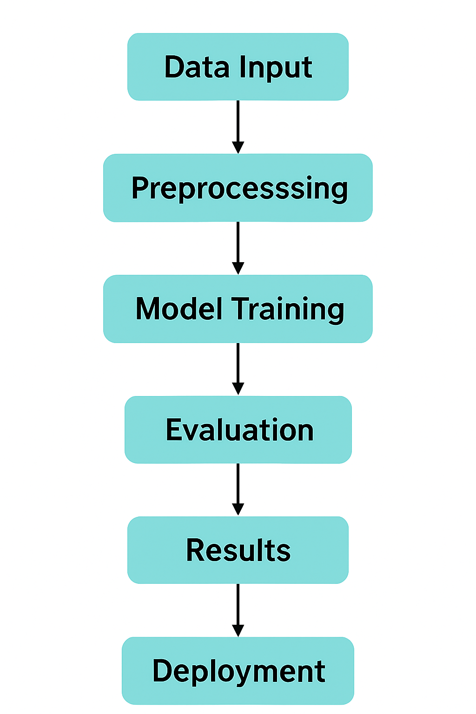

# 🌱 Carbon Footprint Estimator

A machine learning model to predict individual weekly carbon footprint based on behavioral and lifestyle features such as Diet, Transport, Electricity Usage, Vehicle Type, etc.

### AI/ML Entry-Level Assessment Project by Basit Bashir Wani

---

## 📂 Dataset Used

* **Name:** Carbon Footprint.csv
* **Source:** Retrieved from a web-based source.

* **Features:**

  * Diet (Categorical)
  * Transport(Categorical)
  * Electricity Usage (kWh)
  * Vehicle Type(Categorical)
  * Vehicle Monthly Distance(Km)
  * Heating Energy Source(Categorical)
  * ...and more
* **Target:** Weekly Carbon Footprint (in kg CO₂ equivalent)

---
## Approach(Summary)
 * ✅ Cleaned and preprocessed the dataset, handling missing values and encoding categorical variables.
 * ⚙️ Built a reusable pipeline for scaling, encoding, and imputation.
 * 🌲 Trained a Decision Tree Regressor for prediction.
 * 🛠️ Tuned model using RandomizedSearchCV to optimize performance.
 * 📊 Evaluated using R² and RMSE metrics, both before and after tuning.
 * 📉 Analyzed residuals and model outputs for bias and variance.
 ---
 ## 🔄 Workflow Overview

The following flowchart summarizes the key steps in the project:



 ---
 ### 💡 Why Decision Tree Regressor Over Linear Model?

   * A **Decision Tree Regressor** was chosen because:
     * It captures **nonlinear relationships** naturally
     * It handles **categorical variables** without manual encoding tweaks
     * It makes **fewer assumptions** about data structure
     * Unlike linear models, it doesn't need heavy **feature engineering**
 ---
## 🧠 Detailed Approach

### 1. Data Cleaning & Preprocessing
* Checked for missing values and handled them appropriately.

* Developed a reusable preprocessing pipeline that:
  * Handled missing values using a median imputation strategy with SimpleImputer(strategy="median")

  * Encodes categorical variables (like Transport Mode) with OneHotEncoder

  * Scales numerical features using StandardScaler(for linear regressor)

* This pipeline ensures streamlined and consistent data handling for training and inference.
### 2. Model Building

* Implemented a **Decision Tree Regressor** to predict carbon footprint.
* Performed hyperparameter tuning using RandomizedSearchCV with the following parameter distributions:
  * criterion: ['squared_error', 'friedman_mse']
  * splitter: ['best', 'random']
  * max_depth: integers from 3 to 20
  * max_features: ['sqrt', 'log2', None]

* This comprehensive tuning helped optimize model performance and prevent overfitting.


### 3. Evaluation
* **Pre-Scaling/Pipeline**:
    * Cross-validated R² Scores: [0.75356313 0.73702283 0.68046992 0.68663828 0.74053667]
    * Mean R² Score: 0.7196461645644016
* **Post-Scaling/Pipeline**:
    * Before Hyperparameter Tunning: 
       * R² Score: 0.6720282827473432
       * Mean Squared Error (MSE): 472588.8262195122
       * Root Mean Squared Error (RMSE): 687
     * After Hyperparameter Tunning: 
       * R² Score: 0.7404797613009263
       * Mean Squared Error (MSE): 373954.0897440275
       * Root Mean Squared Error (RMSE): 611
* These results indicate a strong predictive ability with acceptable error margins.
### 4. App Development
  * After building and evaluating the model, I developed an interactive web application using Streamlit:
      * Created app.py to allow users to input lifestyle details (e.g., diet, transport, electricity use).
      * Used joblib to load the trained model (carbon_model.pkl) and preprocessing pipeline (carbon_pipeline.pkl).
      * The app collects user input via form fields and makes predictions in real time.
      * Displays the estimated weekly CO₂ footprint on submission.
      * Ready for deployment on platforms like Streamlit Cloud or Render.
---
## 📈 Results Summary
 * Before Scaling / Preprocessing (Raw Data):
   * Cross-validated R² Scores: [0.75, 0.74, 0.68, 0.69, 0.74]
   * Average R² Score: 0.72
   * The model performed well even on raw data, predicting about 72% of the variation in carbon footprint correctly.
   * This means the model could already make good predictions using the original, unprocessed data.
 * Post-Processing & Tuning:
   * Final R² Score: **0.74(The model predicts CO₂ fairly well — it's right about 74% of the time)**
   * RMSE: **611 kg CO₂(On average, the model's predictions are off by 611 kilograms of CO₂.)**
   * Model effectively captures nonlinear relationships using a Decision Tree.
   * Residual analysis confirms minimal bias or variance issues.

## 📊 Bonus Highlights

* 📌 Predicted vs Actual Plot: A scatter plot (like the one shown above) that compares true target values against model predictions. The red dashed line indicates ideal predictions — closer clustering around this line suggests better model performance.

* 📉 Residual Plot: The residual plot reveals a fairly random scatter around zero, suggesting that the model captures the main patterns well. However, the spread at higher predicted values hints at potential variance issues or room for improvement in those ranges.
  
* 📊🔍 Feature Importance Plot: Our model reveals that how far you drive and how often you fly are the biggest contributors to your environmental footprint. Surprisingly, lifestyle choices like diet and electricity usage played a much smaller role in the predictions — highlighting the outsized impact of transportation habits.

* 🧩 Modular Code Snippets: Clean, reusable code blocks for data preprocessing, model training, evaluation, and visualization to support easy experimentation and future updates.

---

## ⚙️ Dependencies

* To run this project, ensure the following Python libraries are installed:
  * NumPy – for numerical computations
  * Pandas – for data manipulation and analysis
  * Matplotlib – for plotting visualizations (e.g., Predicted vs Actual, Residual Plot)
  * Scikit-learn – for model building and evaluation (e.g., Decision Tree Regressor
  * Joblib - for saving and loading the trained machine learning model and pipeline

```bash
pip install pandas numpy matplotlib seaborn scikit-learn joblib
```

Or use the provided `requirements.txt` and run: 
```bash
pip install -r requirements.txt
```
## 👨‍💻 About the Author

**Basit Bashir Wani**  
*B.Tech Electronics and Communication Engineering (ECE)*  
*National Institute of Technology, Srinagar*
